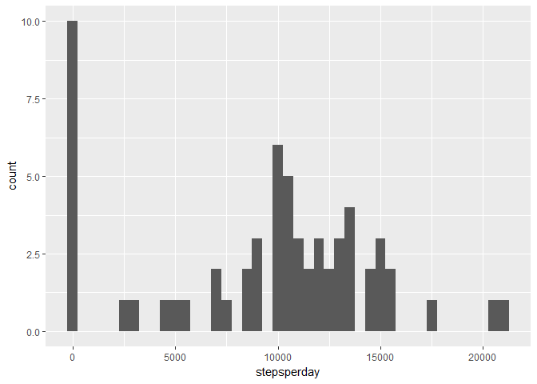
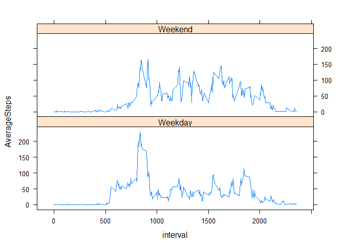

Importing Data
--------------

The code chunk below attempts to import data from a fileset downloaded.
'activity' is the name of dataset which has the imported data set. We
are using colClasses to coerce the data into approproate columns in the
imported Dataset

    activity <- read.csv(file = "activity.csv",header = TRUE,colClasses = c("integer","Date","integer"))

What is mean total number of steps taken per day?
-------------------------------------------------

To arrive at the mean steps per day, we are grouping the dataset by
days. The grouped data set is called as 'gact'. We are applying
summarize function to get the average number of steps per each date
observed. stp stores the resulting dataset which has total number of
steps taken each day.

### Question 1: Calculate the total number of steps taken per day

### Steps taken per day

    library(tidyverse)

    gact <- activity %>% group_by(date)

    stp <- gact %>% summarize(stepsperday = sum(steps, na.rm = TRUE))

    stp

    ## # A tibble: 61 x 2
    ##          date stepsperday
    ##        <date>       <int>
    ##  1 2012-10-01           0
    ##  2 2012-10-02         126
    ##  3 2012-10-03       11352
    ##  4 2012-10-04       12116
    ##  5 2012-10-05       13294
    ##  6 2012-10-06       15420
    ##  7 2012-10-07       11015
    ##  8 2012-10-08           0
    ##  9 2012-10-09       12811
    ## 10 2012-10-10        9900
    ## # ... with 51 more rows

### Total number of steps across the two months

    sum(stp$stepsperday)

    ## [1] 570608

### Question 2: If you do not understand the difference between a histogram and a barplot, research the difference between them. Make a histogram of the total number of steps taken each day

Histograms plot quantitative data with ranges of the data grouped into
bins or intervals while bar charts plot categorical data

A Barplot is made up of a datacolumn plotted on the graph without any
grouping / binning.

    ggplot(data = stp, aes(x = stepsperday)) + geom_histogram(binwidth = 500)

To calculate the mean and median number of steps taken per day we use
the summarize function

    stp <- gact %>% summarize(Total_Steps = sum(steps,na.rm = TRUE))

    sprintf("Total Number of Steps taken: %d", round(sum(stp$Total_Steps,na.rm = TRUE),0))

    ## [1] "Total Number of Steps taken: 570608"

    sprintf("Mean Value of Steps taken per day %d", round(mean(stp$Total_Steps,na.rm = TRUE),0))

    ## [1] "Mean Value of Steps taken per day 9354"

    sprintf("Median Value of Steps taken per day %d", round(median(stp$Total_Steps, na.rm = TRUE),0))

    ## [1] "Median Value of Steps taken per day 10395"

What is the average daily activity pattern?
-------------------------------------------

### Question 1: Make a time series plot (i.e. type = "l") of the 5-minute interval (x-axis) and the average number of steps taken, averaged across all days (y-axis)

First, let's group the dataset by 5 minute interval as noted by column
'interval' and find the average steps taken by interval

    iact <- activity %>% group_by(interval)

    tsp <- iact %>% summarize(Step_Taken = mean(steps, na.rm = TRUE))

Then lets plot a time series graph showing different Interval values and
average of steps per interval

After that lets find the maximum value in the timeseries plot using
which.max function

    plot(x = tsp$interval, y = tsp$Step_Taken, type = "l",main = "Average Steps taken by Interval across all days", xlab = "Interval", ylab = "Steps Taken")

    ind <- which.max(tsp$Step_Taken)

    la <- paste("Maximum Step of",round(tsp$Step_Taken[ind],digits = 0), "was taken on the", tsp$interval[ind],"interval")

    text(x = tsp$interval[ind], y = tsp$Step_Taken[ind],labels = la)

    sprintf(la)

    ## [1] "Maximum Step of 206 was taken on the 835 interval"

Imputing missing values
-----------------------

### Question1: Calculate and report the total number of missing values in the dataset (i.e. the total number of rows with NA's

To find the number of rows with NA, we can use is.na option

    sum(is.na(activity$steps))

    ## [1] 2304

    sum(is.na(activity$date))

    ## [1] 0

    sum(is.na(activity$interval))

    ## [1] 0

Only Steps column have missing values

### Question2:Devise a strategy for filling in all of the missing values in the dataset. The strategy does not need to be sophisticated. For example, you could use the mean/median for that day, or the mean for that 5-minute interval, etc.

### Question3: Create a new dataset

First lets create a new data set

    nactivity <- activity

We already have an indexed table called tsp. tsp has the mean value for
each interval. Our strategy is to use this indexed table to fill missing
steps for each row with the appropriate mean value of the interval to
which the row belongs to.

    sum(is.na(nactivity))

    ## [1] 2304

    for (i in 1:nrow(nactivity))
      {
      if(is.na(nactivity$steps[i]))
        {
        nactivity$steps[i] <- tsp$Step_Taken[tsp$interval ==  nactivity$interval[i]]
        }
    }

    sum(is.na(nactivity))

    ## [1] 0

### Question4: Make a histogram of the total number of steps taken each day and Calculate and report the mean and median total number of steps taken per day. Do these values differ from the estimates from the first part of the assignment? What is the impact of imputing missing data on the estimates of the total daily number of steps? \*

First lets group the new data set by days. Then lets use summarize
function to find the mean and median. Finally we can compare this
against the original activity data set

    nactivity <- group_by(nactivity, date)

    nstp <- nactivity %>% summarize(Total_Steps = sum(steps, na.rm = TRUE))

    ggplot(data = nstp,mapping = aes(nstp$Total_Steps)) +geom_histogram(binwidth = 500)

To compare the two different data sets we are using the summary option

    summary(stp)

    ##       date             Total_Steps   
    ##  Min.   :2012-10-01   Min.   :    0  
    ##  1st Qu.:2012-10-16   1st Qu.: 6778  
    ##  Median :2012-10-31   Median :10395  
    ##  Mean   :2012-10-31   Mean   : 9354  
    ##  3rd Qu.:2012-11-15   3rd Qu.:12811  
    ##  Max.   :2012-11-30   Max.   :21194

    summary(nstp)

    ##       date             Total_Steps   
    ##  Min.   :2012-10-01   Min.   :   41  
    ##  1st Qu.:2012-10-16   1st Qu.: 9819  
    ##  Median :2012-10-31   Median :10766  
    ##  Mean   :2012-10-31   Mean   :10766  
    ##  3rd Qu.:2012-11-15   3rd Qu.:12811  
    ##  Max.   :2012-11-30   Max.   :21194

### While the maximum values remain as is, we are seeing changes in minimum value, a shift in the mean as well as median because of imputing new values

Are there differences in activity patterns between weekdays and weekends?
-------------------------------------------------------------------------

Lets introduce a column to specify if it is a weekday or weekend using
ifelse function

    nactivity$weekday <- ifelse(weekdays(nactivity$date) %in% c("Saturday","Sunday"),"Weekend","Weekday")

    nactivity$weekday <- as.factor(nactivity$weekday)

Now we are grouping the nactivity by weekday and Interval. Also we
create a new dataset called wstp to store the summarize average values

    nactivity <- nactivity %>% group_by(interval, weekday)
    wstp <- nactivity %>% summarize(AverageSteps = mean(steps,na.rm = TRUE))

Post grouping we are using lattice plotting to do a multi panel plotting
of variables

    library(lattice)
    xyplot(AverageSteps~interval|weekday, data = wstp, type = "l",layout = c(1,2))

### During weekday, people are observed to have higher activity levels as compared to weekdays.
